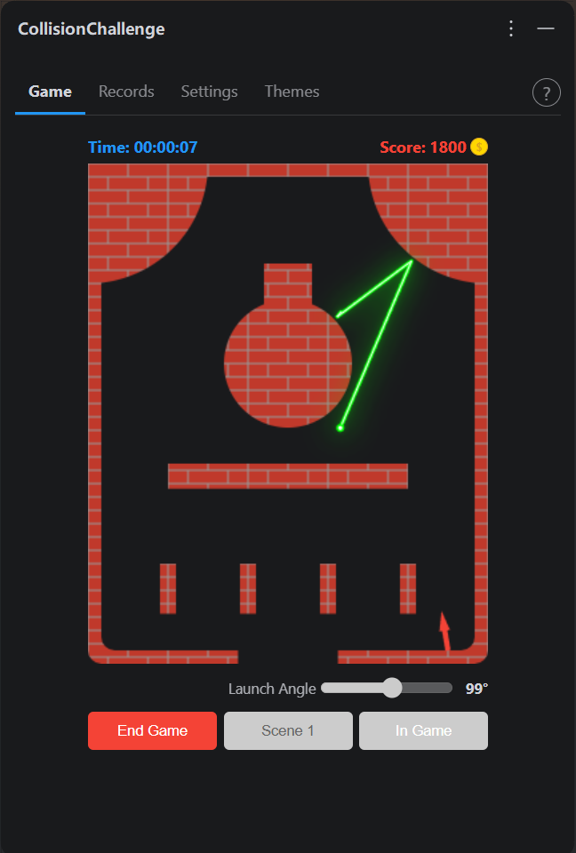
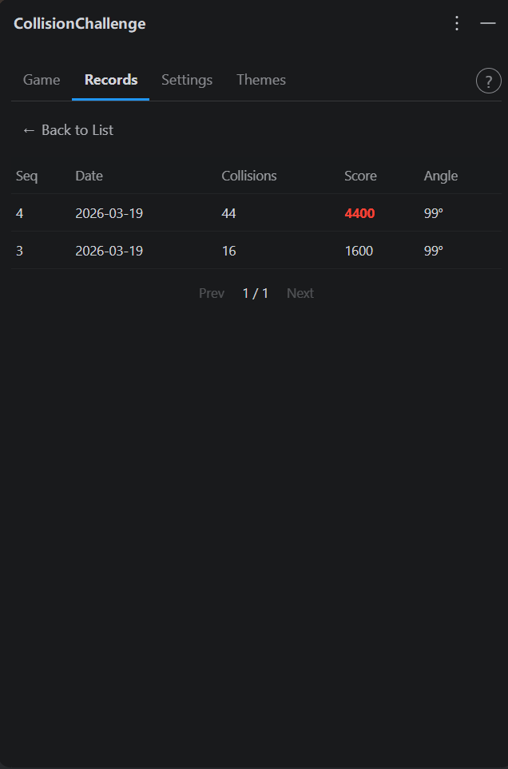
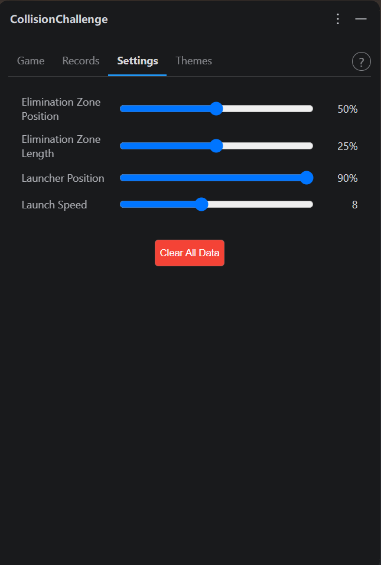
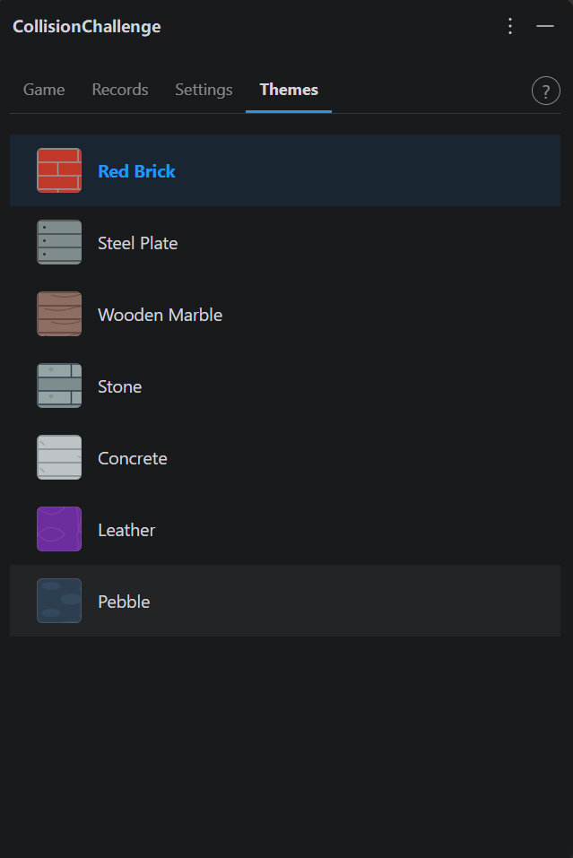
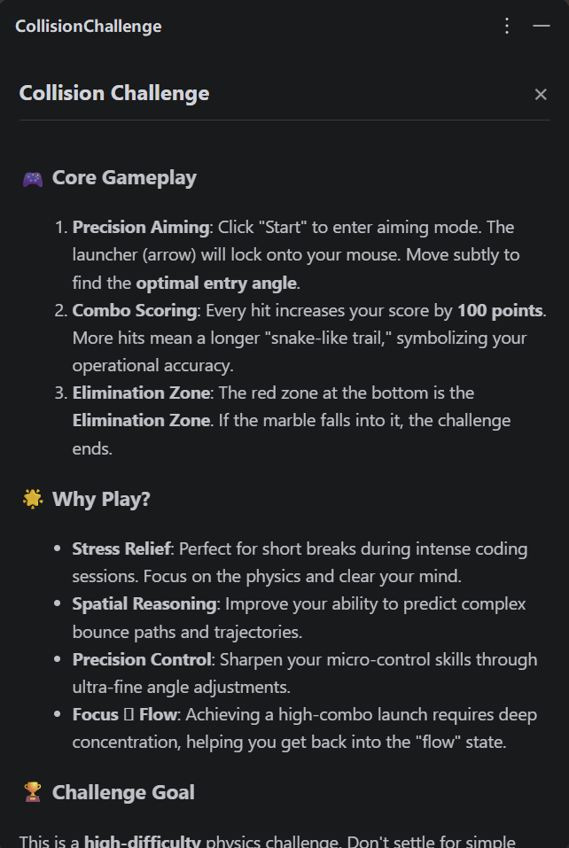

# Collision Challenge - 精准碰撞挑战

**中文版** | [English](./README_EN.md)

**Collision Challenge (精准碰撞)** 是一款专为开发者设计的 IDE 内嵌式物理弹珠挑战游戏。在繁忙的编码间隙，通过精准控制发射角度，让弹珠在障碍物间不断跳跃，挑战你的空间想象力与操作极限。

---

## 🌟 应用介绍

Collision Challenge 无缝集成在 IntelliJ IDEA 界面中，通过 Tool Window 提供极具挑战性的物理模拟体验。这不仅仅是一个消遣小游戏，更是一个锻炼**精准控制**与**逻辑预判**的修研场。

### 核心亮点：
- **精准控制**：游戏的核心在于对发射器角度的微秒级调整。你需要通过滑块或鼠标精准锁定轨迹，以确保弹珠能击中尽可能多的障碍物。
- **高难度挑战**：障碍物布局多变且复杂。每一个障碍物的碰撞都会改变弹珠的动能方向，稍有偏差便会坠入底部的“淘汰区”导致游戏结束。
- **能力提升**：通过不断挑战，玩家可以显著提升**空间逻辑预判能力**、**抗压专注力**以及**极细微操作的精确度**。
- **得分机制**：碰撞的障碍物越多，得分越高。弹珠每碰撞一次得分 +100，并会像贪吃蛇一样增加一节拖尾，增加视觉反馈与成就感。
- **数据复盘**：通过“记录”功能复盘每轮挑战的发射角度、碰撞次数与得分。分析数据，找出最佳发射角度，见证从新手到大师的进阶。

---

## 📷 效果图

  
  
  
  
  

---

## ✨ 功能特性

- **物理模拟**：基于 Canvas 的实时物理碰撞反馈，模拟真实的反弹与动能。
- **多变场景**：内置多个精心设计的关卡场景，障碍物包含矩形、三角形等多种美化后的贴图。
- **个性化主题**：提供红砖、钢板、木质大理石、石头、水泥、皮革、鹅卵石七套精美视觉主题，适配不同开发者的审美。
- **持久化记录**：所有高分记录与挑战数据均持久化存储在本地 JSON 文件中，支持随时清空重置。本地存储文件CollisionChallengeSettings.json 的具体目录是：`Windows系统：C:\Users\[用户名]\AppData\Roaming\JetBrains\[IDE版本]\config\options\CollisionChallengeSettings.json`

    说明：该路径由 PathManager.getConfigPath() 获取 IDE 配置目录，然后在其下的 options 文件夹中创建存储文件。
- **多语言支持**：原生支持中文、英文、日文和韩文。

---

## 🛠️ 安装方式

1. 打开 IntelliJ IDEA。
2. 进入 `Settings` (Windows/Linux) 或 `Settings/Preferences` (macOS)。
3. 选择 `Plugins` 并在搜索框中输入 **Collision Challenge**。
4. 点击 `Install` 并根据提示重启。
5. 安装完成后，在侧边工具栏找到 **Collision Challenge** 图标即可开始挑战。

---

## 🔄 跨版本兼容性

为了确保插件能够上架市场并通过各种版本的 IDE 验证：

- **广泛兼容**：支持 IntelliJ IDEA 2023.1 (Build 231) 至 2026.1 (Build 261) 的所有主流版本。
- **稳定构建**：基于 2024.1.6 稳定 SDK 构建，确保在不同环境下的运行稳定性。

---

## 💰 商业插件说明

**Collision Challenge 是一款商业插件。**

本插件为商业软件，受版权法保护。提供高质量、持续维护的模拟训练体验。

- **试用期**：你可以享受一段时间的免费试用。
- **正式授权**：请前往 [JetBrains Marketplace](https://plugins.jetbrains.com/plugin/com.kuyou.CollisionChallenge) 购买正式许可。

---

## 📞 联系与反馈

- **Vendor**: LittleRelaxation
- **Marketplace**: [Collision Challenge on Marketplace](https://plugins.jetbrains.com/plugin/com.kuyou.CollisionChallenge)

---

© 2026 LittleRelaxation. All rights reserved.
